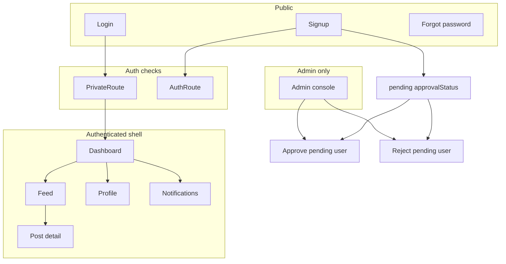

# EngageSphere — Flow of Actions

Narrative and diagram-style flows for **actors**: Guest, Student/Faculty (approved), Admin. Technical steps reference `AppStateContext`, routes, and RTDB paths.

---

## Legend

- **LS** = localStorage (`engagesphere-static-state-v1`, `engagesphere-current-user-v1`).
- **RTDB** = Firebase Realtime Database root `engageApp/`.
- **Provider** = `AppStateProvider` (`src/context/AppStateContext.tsx`).

---

## A. First visit (guest)

1. User opens app → React Router loads `/` → redirect to `/dashboard`.
2. `PrivateRoute` sees no session → redirect to `/login`.
3. Optional: expand **Demo users**, use **Copy into form**, submit **Login**.

---

## B. Login (approved user)

1. User submits email/password on `/login`.
2. `login()`:
   - **Local**: scan `data.users` for matching email+password.
   - **RTDB**: `get` users subtree via `rtdbFindUserByEmail`, compare password.
3. If `approvalStatus === "pending"` → **stop** with error message (no session).
4. Else set `currentUserId` in state + LS session key.
5. Navigate to `/dashboard`.
6. `AppLayout` renders sidebar; **Admin** nav item visible only if `role === "Admin"`.

---

## C. Signup (Student / Faculty)

1. Guest opens `/signup`.
2. Chooses **Student** or **Faculty** (Admin option absent).
3. Submits form → `register()` creates user with `approvalStatus: "pending"`.
   - **Local**: prepend user to `users` array in LS-backed state (no session set).
   - **RTDB**: `set` `engageApp/users/{id}` with pending flag (undefined fields stripped).
4. UI shows **confirmation**; user taps **Back to sign in**.
5. Attempting login before approval → **blocked** with pending message.

---

## D. Admin approves or rejects signup

1. Admin logs in → opens `/admin`.
2. **Registration approvals** lists users where `approvalStatus === "pending"`.
3. **Approve** → `approvePendingUser(id)`:
   - Local: rewrite user without `approvalStatus`.
   - RTDB: `update` `…/users/{id}/approvalStatus` = `null` (removes field).
4. **Reject** → `rejectPendingUser(id)`:
   - Local: filter user out of array.
   - RTDB: `update` `…/users/{id}` = `null` (delete node).
5. User directory and stats refresh from new snapshot (RTDB) or immediate state (local).

---

## E. Session guard (RTDB + pending edge cases)

1. After `appReady`, effect runs: if session id points to **missing** user or **pending** user → clear session (logout).
2. Prevents stale session after reject, or mid-flight empty dataset flicker (gated on `appReady`).

---

## F. Create post

1. Approved user opens `/feed` (or uses dashboard quick paths where applicable).
2. `createPost()` builds `Post` with new id, `userId`, timestamps.
3. **Local**: prepend to `posts` in `AppData`, persist LS.
4. **RTDB**: `set` `engageApp/posts/{id}`; listener merges snapshot → UI updates.

---

## G. Edit / delete post

1. **Edit**: owner or Admin; `updatePost` patches content/image/updatedAt (RTDB shallow `update` paths).
2. **Delete**: owner or Admin; removes post and **cascades** comments, likes, notifications for that `postId`.

---

## H. Comment

1. User opens post (feed or `/post/:id`).
2. `addComment()` inserts `Comment`; if commenter ≠ post owner, push **notification** to owner (local array or RTDB multi-path write).

---

## I. Like / unlike

1. `toggleLike()` finds existing `(postId, userId)` like.
2. If exists → remove like (and no new notification).
3. If not → add like; if liker ≠ owner → add **like** notification.

---

## J. Notifications triage

1. User opens `/notifications`.
2. Can filter, open linked post, **Mark all read** (batch `isRead: true` for receiver’s items).

---

## K. Profile update

1. User opens `/profile`, edits fields, saves.
2. `updateProfile()` patches user fields (RTDB multi-field `update` under `users/{id}/`).

---

## L. Dashboard analytics (read-only aggregate)

1. `useDashboardDerived` recomputes from `data` whenever posts/comments/likes/users/notifications change.
2. Charts and KPIs **do not** write new domain data (except drafts card, which is local UI state only).

---

## M. Logout

1. User clicks Logout in sidebar → `logout()` clears session LS + `currentUserId`.
2. Router protection sends user to `/login` on next navigation.

---

## N. Restore demo seed

1. From login screen: **Restore demo accounts & sample posts**.
2. `resetDemoToSeed()` replaces entire `AppData` with `initialData` from `src/data/seed.ts` (10 users, 100 posts, synthetic engagement).
3. **RTDB**: `set` whole `engageApp` tree via `rtdbSetFullTree`.
4. Session cleared so user picks a demo role again.

---

## O. Deploy path (Netlify)

1. `npm run build` → `dist/`.
2. Netlify build command and publish dir per `netlify.toml`; SPA fallback ensures client routes resolve.

---

## Flow diagram (Mermaid — paste into report tools)

---

*Use this file for “Sequence of operations” and “User journey” chapters in academic documentation.*
